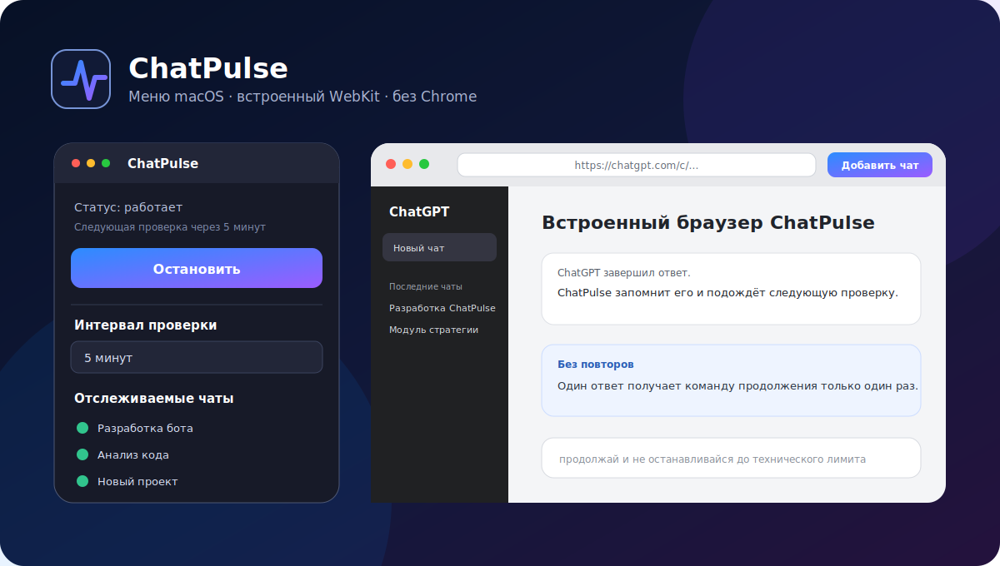

# ChatPulse

[](https://github.com/mishkacher/ChatPulse/actions/workflows/ci.yml)
[](https://github.com/mishkacher/ChatPulse/actions/workflows/release.yml)
[](https://github.com/mishkacher/ChatPulse/releases/latest)
[](https://github.com/mishkacher/ChatPulse)
[](https://github.com/mishkacher/ChatPulse/releases/latest)
[](https://www.swift.org/)
[](LICENSE)

**ChatPulse** — нативная утилита строки меню macOS, которая следит за выбранными разговорами ChatGPT и при необходимости отправляет точную команду:

> продолжай и не останавливайся до технического лимита

Приложение работает через собственный встроенный браузер на системном движке **WebKit**. Google Chrome, Playwright, Ollama, внешний ИИ и платные API не нужны.



## Статус

Текущая версия: **0.4.0** — первый публичный релиз.

- macOS 13 Ventura и новее;
- универсальный бинарник **Universal 2** для `arm64` и `x86_64`;
- поддержка Mac с Apple Silicon и Intel;
- Swift 6;
- пять независимых полных CI-циклов на macOS 15 для каждого Pull Request;
- автоматическая публикация ZIP и SHA-256 после успешной проверки основной ветки;
- исходный код распространяется по лицензии MIT.

## Быстрая установка из релиза

1. Откройте раздел [Releases](https://github.com/mishkacher/ChatPulse/releases/latest).
2. Скачайте:
   - `ChatPulse-macOS-v0.4.0.zip`;
   - `ChatPulse-macOS-v0.4.0.zip.sha256`.
3. Проверьте checksum:

```bash
cd "$HOME/Downloads"
shasum -a 256 -c ChatPulse-macOS-v0.4.0.zip.sha256
```

Ожидаемый результат заканчивается словом `OK`.

4. Распакуйте ZIP.
5. Переместите `ChatPulse.app` в `/Applications` или `~/Applications`.
6. Запустите приложение.

### Первый запуск и Gatekeeper

Открытая сборка имеет корректную ad-hoc подпись и hardened runtime, но пока не подписана сертификатом Apple Developer ID и не нотарифицирована Apple. Поэтому macOS может потребовать ручное подтверждение первого запуска.

Используйте стандартный способ:

- нажмите `ChatPulse.app` правой кнопкой мыши и выберите **Открыть**;
- либо откройте **System Settings → Privacy & Security** и подтвердите запуск.

Не отключайте Gatekeeper целиком.

## Установка из исходников

Для локальной сборки нужны Xcode Command Line Tools и Swift 6:

```bash
cd ~
rm -rf "$HOME/ChatPulse-install"
git clone --depth 1 https://github.com/mishkacher/ChatPulse.git "$HOME/ChatPulse-install"
cd "$HOME/ChatPulse-install"
bash scripts/install_app.sh
```

Скрипт собирает Universal 2 приложение и устанавливает его в `/Applications/ChatPulse.app`, а без прав записи — в `~/Applications/ChatPulse.app`.

Для повторного запуска:

```bash
open "/Applications/ChatPulse.app" 2>/dev/null || open "$HOME/Applications/ChatPulse.app"
```

## Первое использование

1. Нажмите значок ChatPulse в строке меню macOS.
2. Выберите **«Открыть браузер ChatPulse…»**.
3. Выберите скин интерфейса.
4. Нажмите **«Войти ▾»**.
5. Используйте **email / одноразовый код** или заранее настроенный **passkey**.
6. После входа откройте конкретный разговор ChatGPT.
7. Нажмите **«Добавить чат»**.
8. Повторите для остальных разговоров.
9. Выберите интервал проверки.
10. Нажмите **«Запустить»**.

## Как работает мониторинг

1. Первая проверка после запуска только запоминает текущий ответ и ничего не отправляет.
2. Когда появляется новый ответ, ChatPulse снова только фиксирует его.
3. Если на следующей проверке ответ не изменился, завершён и принадлежит ассистенту, приложение отправляет команду продолжения.
4. После фактического нажатия кнопки отправки отпечаток ответа помечается обработанным.
5. Один ответ не может получить команду повторно, даже если интерфейс не успел подтвердить появление сообщения.
6. Перед отправкой приложение повторно проверяет, что мониторинг не остановлен, а чат не удалён и не отключён.

Такая схема намеренно не перезапускает разговор сразу после нового ответа.

## Интерфейс

В меню строки состояния доступны:

- текущий статус;
- одна динамическая команда **«Запустить / Остановить»**;
- ручная проверка;
- интервалы 1, 2, 5, 10, 15 и 30 минут;
- собственный интервал от 30 секунд до 24 часов;
- открытие браузера ChatPulse;
- добавление текущего разговора;
- включение, открытие и удаление сохранённых чатов;
- выбор скина;
- окно **«О ChatPulse…»** с версией и номером сборки;
- журнал последних действий.

## Скины

### macOS

Нативные материалы, системные кнопки и автоматическое следование светлому или тёмному режиму macOS.

### ChatPulse Preview

Фирменный стиль из SVG-превью:

- фон: `#071126 → #11183A → #24123D`;
- акцент: `#2C8CFF → #9B5CFF`;
- светлый основной текст;
- тёмные элементы управления;
- градиентная кнопка **«Добавить чат»**.

Выбор применяется сразу и сохраняется после перезапуска. Скин изменяет только нативную оболочку ChatPulse, а не страницу ChatGPT.

## Вход

### Email / одноразовый код

ChatPulse открывает официальный экран входа OpenAI и помогает перейти к доступному email-сценарию. Код приходит от OpenAI и вводится только на странице входа.

Приложение не читает почту, не перехватывает код и не сохраняет email.

### Passkey

WebKit передаёт WebAuthn-запрос системному интерфейсу macOS. Passkey должен быть заранее добавлен в аккаунт и доступен через iCloud Keychain, совместимый менеджер учётных данных или аппаратный ключ.

### Google OAuth

Социальный вход Google внутри управляемого приложением WebView не используется. ChatPulse распознаёт такой переход и предлагает email-код или passkey вместо обхода ограничений провайдера.

## Конфиденциальность и безопасность

ChatPulse:

- не читает cookies Safari или Chrome;
- использует отдельное постоянное хранилище WebKit;
- не сохраняет пароли, email, одноразовые коды или passkey;
- не получает доступ к почтовому ящику;
- не сохраняет содержимое всей переписки;
- не отправляет телеметрию;
- не использует внешний ИИ или платный API;
- принимает только URL разговоров на официальных доменах ChatGPT;
- не пытается обходить технические лимиты или ускорять их сброс.

Подробнее: [SECURITY.md](SECURITY.md).

## Хранение настроек

Рабочие настройки мониторинга:

```text
~/Library/Application Support/ChatPulse/settings.json
```

В файл записываются названия и URL чатов, включённое состояние, интервал, отпечатки последних ответов и результаты отправки.

Выбранный скин хранится отдельно в `UserDefaults` под ключом `ChatPulse.ui.skin`.

## Разработка и проверка

```bash
make test
make audit
make build
make preflight
```

Релизный preflight включает:

- debug- и release-тесты;
- 20 обязательных quality gates;
- проверку shell-скриптов;
- Universal 2 release-сборку;
- обязательное наличие архитектур `arm64` и `x86_64`;
- проверку `Info.plist`;
- проверку версии и build number;
- строгую проверку code signature, hardened runtime, bundle identifier и иконки.

CI выполняет этот набор в пяти независимых macOS-окружениях. После успешной CI основной ветки отдельный workflow повторяет preflight, формирует ZIP, создаёт checksum и публикует GitHub Release.

## Известные ограничения

- интерфейс ChatGPT может измениться и потребовать обновления DOM-селекторов;
- доступность email-входа зависит от конфигурации аккаунта;
- passkey должен быть зарегистрирован заранее;
- Google OAuth внутри встроенного браузера намеренно не поддерживается;
- системное меню строки состояния оформляется самой macOS и не перекрашивается фирменным скином;
- текущий релиз не нотарифицирован Apple;
- приложение не обходит и не ускоряет сброс лимитов ChatGPT.

## Документация

- [Архитектура](docs/ARCHITECTURE.md)
- [Установка и устранение неполадок](docs/SETUP.md)
- [План тестирования](docs/TEST_PLAN.md)
- [Релизный чек-лист](docs/RELEASE_CHECKLIST.md)
- [20 раундов оптимизации и аудита](docs/OPTIMIZATION_AUDIT.md)
- [История изменений](CHANGELOG.md)
- [Поддержка](SUPPORT.md)
- [Модель безопасности](SECURITY.md)
- [Правила участия](CONTRIBUTING.md)

## Удаление

```bash
bash scripts/uninstall_app.sh
```

Приложение удаляется, а рабочие настройки по умолчанию сохраняются в Application Support.

## Лицензия

MIT License. См. [LICENSE](LICENSE).
